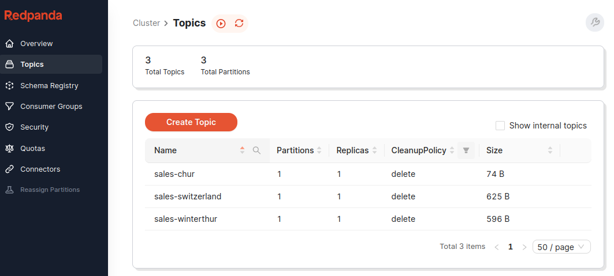
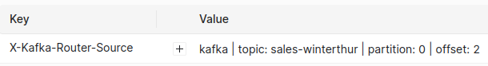

# Kafka Router

The Kafka Router allows you to consume data from multiple Kafka instances / topics and route them to other Kafka instances / topics.

## Use Cases

- **clone** Kafka data <br>e.g. consume data from a demo environment and replicate it to your local Kafka.
- **proxy** external Kafka instances <br>e.g. have one whitelisted host consume from external Kafka sources and replicate data to internal Kafka instances, can also go the other way by routing data from internal Kafka sources to external Kafka instances.
- **merge** messages <br>from multiple topics into one aggregate topic.


## Environment variables

Two environment variables are used:

- `CONFIG_FILE`: the path to the config file. Default: `/config/config.yaml`. The config file can be YAML (`*.yaml`, `*.yml`) or JSON (`*.json`).
- `RESSOURCE_PATH`: the path to the directory for additional resources (truststores, keystores, etc.). Default: `/config`.

## Configuration

The config file format can be YAML (`*.yaml`, `*.yml`) or JSON (`*.json`), auto-detected over the file suffix.

### General config

General configuration:

Properties:

- `consumer-group` <br>
Name of the consumer group for the Kafka Router (allowing multiple instances
  running concurrently and resuming data processing from committed offsets). <br>
_Default_: `kafka-router`
- `backoff-strategy.backoff-time-seconds` <br>
When messages were read but could not be delivered (e.g. when the target Kafka is not reachable),
the messages will not be committed in the source, but message delivery is retried instead. The backoff times (list of integers for seconds)
state after how many seconds a next attempt at delivering the messages should be made for the first, second, ..., attempt. <br>
_Default_: `1, 1, 2, 3, 5, 10` (after the 5th retry, wait 10 seconds before trying again).


```yaml
consumer-group: kafka-router
backoff-strategy:
  backoff-time-seconds: 1,2,3,4,5,10,30,60
```

### Kafka instances

Configure the Kafka instances you want to work with (as a consumer or provider, or both).

Config prefix: `kafka`: map of Kafka instance key (used for routing config) with Kafka properties.

Properties:

- `bootstrap-servers`: Kafka bootstrap servers, required.
- `truststore-path`: for TLS connections: path to the X.509 truststore.
- `truststore-password`: password of the truststore.
- `keystore-path`: for MTLS connections: path to the X.509 keystore.
- `keystore-password`: password of the keystore.
- `properties`: additional Kafka properties, as key/value pairs

```yaml
kafka:

  city-winterthur:
    bootstrap-servers: localhost:9092

  country-switzerland:
    bootstrap-servers: external.kafka-host.org:443
    truststore-path: example-truststore.p12
    truststore-password: SeCrEt-007!
    keystore-path: example-keystore.p12
    keystore-password: SeCrEt-007!
```

### Message routing

Configure the message routing (from which sources you want to consume data, and where it should be published):

Config prefix: `routes`: list of routes, with the following properties:

- `source`: Kafka instance key (see above) from where data should be consumed.
- `source-topic`: Source topic name, regular expression (allowing to specify several source topics)
- `target`: Kafka instance key (see above) to which data should be routed.
- `target-topic`: Optional target topic. If absent, the same topic as the source of the message is used.

```yaml
routes:

  # copy the sales topic from winterthur to switzerland
  - source: city-winterthur
    source-topic: sales
    target: country-switzerland
    target-topic: sales-winterthur
    
  # copy the sales topic from chur to switzerland
  - source: city-chur
    source-topic: sales
    target: country-switzerland
    target-topic: sales-chur
    
  # collect the sales from all locations to a sales-all topic
  - source: country-switzerland
    source-topic: sales-.+
    target: country-switzerland
    target-topic: sales-all
    
  # collect all sales globally
  - source: country-switzerland
    source-topic: sales-all
    target: global
    target-topic: all-sales
```

## Maven Build / run

Build with Maven (default goals: `clean install`):

```shell
mvn
```
This builds an Uber JAR (portable Java application with libraries included), which you can run with:

```shell
java -jar target/kafka-router.jar
```

### Docker build / run

Build the docker image:

```shell
mvn && docker build -t pwalser75/kafka-router .
```

Run the docker container:

```shell
docker run -it --volume ./config:/config pwalser75/kafka-router
```

### Docker-compose example

Complete example with **Kafka-Router**, **Kafka** and **Redpanda Console** (Kafka viewer):

```shell
docker-compose up
```

or in detached mode:

```shell
docker-compose up -d
```

You can then view the logs with:
```shell
docker logs -f kafka-router
```

```text
   __ __     _____          ___            __
  / //_/__ _/ _/ /_____ _  / _ \___  __ __/ /____ ____
 / ,< / _ `/ _/  '_/ _ `/ / , _/ _ \/ // / __/ -_) __/
/_/|_|\_,_/_//_/\_\\_,_/ /_/|_|\___/\_,_/\__/\__/_/
         https://github.com/pwalser75/kafka-router

13:15:49.439 INFO  [main] | c.f.tools.kafkarouter.ResourceLoader - reading configuration from /config/config.yaml
13:15:49.593 INFO  [main] | c.f.tools.kafkarouter.KafkaRouterMain - Configuring routes:
13:15:49.593 INFO  [main] | c.f.tools.kafkarouter.KafkaRouterMain - - kafka (sales-winterthur) -> kafka (sales-switzerland)
13:15:49.712 INFO  [main] | c.f.tools.kafkarouter.KafkaRouterMain - - kafka (sales-chur) -> kafka (sales-switzerland)
13:15:49.719 INFO  [main] | c.f.tools.kafkarouter.KafkaRouterMain - Starting routes:
13:15:49.720 INFO  [main] | c.f.tools.kafkarouter.KafkaRouter - Joining consumer group...
13:15:49.720 INFO  [main] | c.f.tools.kafkarouter.KafkaRouter - Subscribing to initial topics: 
13:15:52.758 INFO  [main] | c.f.tools.kafkarouter.KafkaRouter - - sales-winterthur
13:15:52.759 INFO  [main] | c.f.tools.kafkarouter.KafkaRouter - Joining consumer group...
13:15:52.759 INFO  [main] | c.f.tools.kafkarouter.KafkaRouter - Subscribing to initial topics: 
13:15:52.763 INFO  [main] | c.f.tools.kafkarouter.KafkaRouter - - sales-chur
13:15:52.764 INFO  [main] | c.f.tools.kafkarouter.KafkaRouterMain - Startup complete, ready to route messages...
```

The **Redpanda Kafka Viewer** is accessible over http://localhost:9000. Here you see the topics, and can also upload test messages 
(select topic, then _Actions>Publish Message_) and check if they're routed.



The Kafka Router also adds an additional header `X-Kafka-Router-Source`,
stating from which source / topic / partition / offset the messages was routed:


